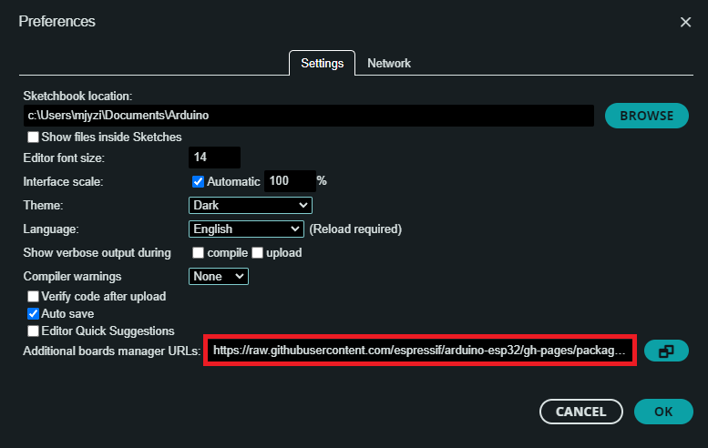
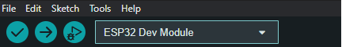

# **Flash firmware**

This page explains how to (re)flash Spikeling firmware onto the microcontroller. The recommended workflow uses the Arduino IDE and follows the same setup steps described in the Spikeling instruction manual (ESP32 add-on install, board selection, required libraries).

You typically only need to flash firmware when:

- you are setting up a new device for the first time
- you want to update to a newer firmware release
- the device is behaving unexpectedly and you want a clean re-flash
- you are developing/modifying the Arduino code

!!! warning "Close anything that uses the serial port"
    Before flashing, close the Spikeling GUI, Arduino Serial Monitor, and any serial terminal (PuTTY, CoolTerm, screen, minicom, etc.). Only one program can use the port at a time.

---

## **Board families and USB differences**

- **Spikeling v2.x (e.g., v2.5)**: ESP32 (WROOM-32), **mini-USB**, USB-to-UART bridge (**CP210x**) → CP210x driver is typically required.
- **Spikeling v3.x (e.g., v3.0)**: ESP32-S3 (WROOM-1), **USB-C**, native USB (USB CDC) → driver typically not required.

The driver and Arduino setup below is essential for v2.x and still applies to v3.x (same ESP32 Arduino core), but the **board selection** differs.
---

## **Step 1 — Install CP210x driver (v2.x only)**

Spikeling v2.x uses a CP210x USB-to-UART bridge. Install the Silicon Labs CP210x driver so the board appears as a serial/COM port.

Links :
```
CP210x driver page:
https://www.silabs.com/developers/usb-to-uart-bridge-vcp-drivers

Downloads tab:
https://www.silabs.com/developers/usb-to-uart-bridge-vcp-drivers?tab=downloads
```

After installing the driver:
- unplug/replug the board
- confirm a COM/serial port appears (see Quickstart → Hardware setup)

---

## **Step 2 — Install Arduino IDE**

Download and install the Arduino IDE.

Link:
```
https://www.arduino.cc/en/software
```

---

## **Step 3 — Install the ESP32 add-on (Espressif Arduino core)**

In Arduino IDE:

1. Go to **File → Preferences**


2. In **Additional Board Manager URLs**, add:



3. Click **OK**

4. Open **Tools → Board → Boards Manager…**

5. Search for **ESP32**

6. Install **“ESP32 by Espressif Systems”**


---

## **Step 4 — Select the correct board target (FQBN)**

### **For Spikeling v2.x (ESP32 WROOM-32)**

Select:

- **Tools → Board → esp32 → ESP32 Dev Module**


### **For Spikeling v3.x (ESP32-S3 WROOM-1)**

Select an ESP32-S3 target, typically:

- **Tools → Board → esp32 → ESP32S3 Dev Module**


(Exact naming can vary slightly by Arduino-ESP32 core version; the key is selecting an **ESP32-S3** board definition.)

---

## **Step 5 — Install required Arduino libraries**

Before compiling the Spikeling firmware, install these libraries:

- **SerialCommand**:  SerialCommand Library by Shyd (based on Steven Cogswell) ```https://github.com/shyd/Arduino-SerialCommand```

- **MCP_ADC**:  Microchip SPI ADC Library by Rob Tillaart ```https://github.com/RobTillaart/MCP_ADC```

- **MCP_DAC**:  Microchip SPI DAC Library by Rob Tillaart ```https://github.com/RobTillaart/MCP_DAC```

- **Gaussian**:  Gaussian Library by Ivan Seidel ```https://github.com/ivanseidel/Gaussian```

- **WebSocketsServer**:  Websockets for Arduino(Server + Client) by Markus Sattler ```https://github.com/Links2004/arduinoWebSockets```

- **ArduinoJson**:  A simple and efficient JSON library for embedded C++ by Benoit Blanchon ```https://arduinojson.org/?utm_source=meta&utm_medium=library.properties```


Install via:

- **Sketch → Include Library → Manage Libraries**
- Search by name and click **Install**

### **Manual install note (Arduino-SerialCommand)**

You could also manually place the Arduino library folder from the repository into your Arduino libraries directory (especially on Windows).

Windows example path from the manual:

- `C:/Users/<you>/Documents/Arduino/libraries`

Repository location:
```
https://github.com/OpenSourceNeuro/Spikeling-V2/tree/main/Arduino%20Code/Librairies
```

---

## **Step 6 — Open the firmware sketch**

1. Locate the Spikeling firmware `.ino` in the repository’s Arduino code folder.
2. Open the `.ino` in Arduino IDE.
3. Keep accompanying `.h/.cpp` files in the same folder (do not separate them).

---

## **Step 7 — Select the port and upload**

1. Plug in the board.
2. Select the serial port:

- **Tools → Port → (select the port that appears when you plug the device in)**

3. Click **Upload**.

Arduino IDE will compile the code and flash it to the board.

---

## **If upload fails: bootloader (download) mode**

If the upload fails (common symptoms: “Timed out waiting for packet header”, “Failed to connect”), force the ESP32 into download mode.

Typical sequence on many ESP32/ESP32-S3 boards:
1. Hold **BOOT**
2. Tap **RESET/EN**
3. Release **BOOT** when the upload starts

If your Spikeling PCB does not expose BOOT/RESET buttons, consult your board silkscreen or the project’s instruction manual for the exact procedure.

---

## **Verify firmware after flashing**

After a successful upload:

1. Unplug/replug the board.
2. Launch the Spikeling GUI.
3. Select the correct port and connect.
4. Confirm you get live traces and the device responds to controls.

If the GUI connects but behavior is incorrect:
- confirm you flashed the firmware variant that matches your board family (v2.x vs v3.x)
- reflash after a clean rebuild (Arduino IDE compile + upload)
