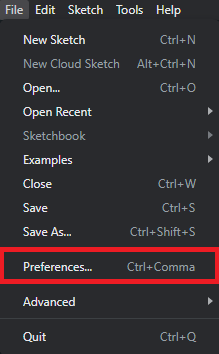
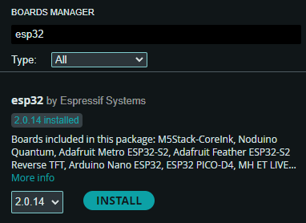
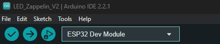
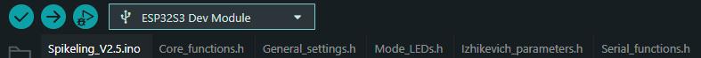

<p align="left">
  
</p>

<div align="center">

# **Upload firmware and install drivers**

<p>
  <a href="../LICENSES/GPL-3.0-or-later.txt">
    
  </a>
  <a href="./Spikeling_V2.5">
    
  </a>
  <a href="./Spikeling_V3">
    
  </a>
  <a href="https://opensourceneuro.github.io/Spikeling/firmware/">
    
  </a>
</p>

</div>

Spikeling firmware is written in Arduino-style C++ and runs on ESP32-based hardware. This page explains how to install the Arduino IDE, add ESP32 board support, install the required libraries, select the correct board target, and upload firmware to either **Spikeling v2.x** or **Spikeling v3.x**.

**Quick links**
- [Spikeling v2.5 source](./Spikeling_V2.5)
- [Spikeling v3 source](./Spikeling_V3)
- [Bundled libraries](./Librairies)
- [Firmware documentation](https://opensourceneuro.github.io/Spikeling/firmware/)
- [Quickstart: Flash firmware](https://opensourceneuro.github.io/Spikeling/quickstart/flash-firmware/)

<p align="right">
  developed by M.J.Y. Zimmermann<br>
  maintained by P. Rignanese & A. Koumoundourou<br>
  based on an original idea by T. Baden
</p>

---

## **1. Choose your hardware version**

### **Spikeling v2.x**
- Based on an **ESP32 WROOM-32**
- Connected through a **USB-to-UART bridge**
- Usually requires the **CP210x driver**
- Firmware folder: [`./Spikeling_V2.5`](./Spikeling_V2.5)

### **Spikeling v3.x**
- Based on an **ESP32-S3 WROOM-1**
- Uses **native USB**
- Usually does **not** require a separate USB-to-UART driver
- Firmware folder: [`./Spikeling_V3`](./Spikeling_V3)

> The Arduino IDE setup is largely shared across both generations. The main differences are the board target, USB behaviour, and the additional DAC library required for v3.x.

---

## **2. Install Arduino IDE**

Download and install the Arduino IDE from the official website:

- [Arduino IDE download page](https://www.arduino.cc/en/software)

---

## **3. Install the ESP32 board package**

Once the Arduino IDE is installed, add the Espressif ESP32 board support package.

### **Step 1 — Open Preferences**

In Arduino IDE, go to:

**File > Preferences**



### **Step 2 — Add the ESP32 board manager URL**

Paste the following into **Additional Board Manager URLs**:

```text
https://raw.githubusercontent.com/espressif/arduino-esp32/gh-pages/package_esp32_index.json
```


Then click **OK**.

### **Step 3 — Install the ESP32 package**

Open:

**Tools > Board > Boards Manager...**

Search for **ESP32** and install:

**ESP32 by Espressif Systems**



---

## **4. Install required libraries**

Open:

**Sketch > Include Library > Manage Libraries...**

Then search and install the libraries below.

### **Core libraries**
- **Arduino-SerialCommand** — Shyd (based on Steven Cogswell)  
  <https://github.com/shyd/Arduino-SerialCommand>
- **Gaussian** — Ivan Seidel  
  <https://github.com/ivanseidel/Gaussian>
- **MCP_ADC** — Rob Tillaart  
  <https://github.com/RobTillaart/MCP_ADC>

### **Additional library for Spikeling v3.x**
- **MCP_DAC** — Rob Tillaart  
  <https://github.com/RobTillaart/MCP_DAC>

### **Optional libraries for Wi-Fi / extended branches**
- **arduinoWebSockets** — Markus Sattler  
  <https://github.com/Links2004/arduinoWebSockets>
- **ArduinoJson** — Benoit Blanchon  
  <https://arduinojson.org/>

Libraries can also be installed manually from the repository folder:

- [Bundled libraries](./Librairies)

**Windows Arduino libraries folder**
```text
C:/Users/<your-user-name>/Documents/Arduino/libraries
```

---

## **5. Open the firmware sketch**

Open the `.ino` file that matches your hardware:

- **Spikeling v2.x** → `Spikeling_V2.5/Spikeling_V2.5.ino`
- **Spikeling v3.x** → `Spikeling_V3/Spikeling_V3.ino`

Keep the `.ino`, `.h`, and associated source files together in the same folder.

---

## **6. Select the correct board target (FQBN)**

### **For Spikeling v2.x**
Select:

**Tools > Board > esp32 > ESP32 Dev Module**



### **For Spikeling v3.x**
Select:

**Tools > Board > esp32 > ESP32S3 Dev Module**



For **Spikeling v3.x**, also confirm these Arduino IDE settings:

```text
Core / Board
  Tools > Board:                 ESP32S3 Dev Module
  Tools > USB Mode:              Hardware CDC and JTAG (wording may vary)
  Tools > USB CDC On Boot:       Enabled

CPU / Flash / PSRAM
  Tools > CPU Frequency:         240MHz
  Tools > Flash Frequency:       80MHz
  Tools > Flash Mode:            QIO 80MHz
  Tools > Flash Size:            4MB
  Tools > PSRAM:                 Disabled
```

---

## **7. Driver installation**

### **Spikeling v2.x**
Spikeling v2.x uses a CP210x USB-to-UART bridge. Install the Silicon Labs **CP210x** driver so the board appears as a serial / COM port.

- [CP210x driver page](https://www.silabs.com/developers/usb-to-uart-bridge-vcp-drivers)
- [CP210x downloads](https://www.silabs.com/developers/usb-to-uart-bridge-vcp-drivers?tab=downloads)

After installation, unplug and reconnect the board.

### **Spikeling v3.x**
Spikeling v3.x uses the ESP32-S3 native USB interface, so a separate USB-to-UART driver is generally not required.

---

## **8. Compile and upload**

1. Connect the board to your computer.
2. Select the correct serial port in:

   **Tools > Port**

3. Click **Verify** to compile the firmware.
4. Click **Upload** to flash the board.

Before uploading, close any software that may already be using the serial port, such as:
- the Spikeling GUI
- Arduino Serial Monitor
- PuTTY, CoolTerm, or other serial terminals

Only one application can use the serial port at a time.

---

## **9. If upload fails**

Common causes include:
- wrong board target selected
- wrong serial port selected
- missing Arduino library
- serial port already in use
- the ESP32 not entering bootloader mode

A common recovery sequence on many ESP32 boards is:

1. Hold **BOOT**
2. Tap **RESET** or **EN**
3. Release **BOOT** when the upload starts

If your board does not expose BOOT / RESET buttons, check the PCB silkscreen or the project documentation for the exact procedure.

---

## **10. Verify after flashing**

After a successful upload:

1. Unplug and reconnect the board
2. Launch the Spikeling GUI
3. Select the correct serial port
4. Confirm that the GUI connects and live traces are received

If the GUI connects but the behaviour is incorrect, first confirm that the uploaded firmware matches the hardware generation:

- `Spikeling_V2.5` for **v2.x hardware**
- `Spikeling_V3` for **v3.x hardware**

---

## **11. Troubleshooting checklist**

### **Board does not appear in Tools > Port**
- reinstall the CP210x driver for v2.x
- try another USB cable
- unplug and reconnect the board
- try another USB port

### **Compilation fails with a missing library error**
- install the missing library through **Manage Libraries**
- check whether it belongs in your Arduino `libraries` folder
- confirm the library folder name is correct

### **Upload starts but never completes**
- close the GUI and all serial monitors
- verify the board target again
- retry using bootloader mode

### **Firmware uploads but the GUI does not respond**
- confirm the correct firmware version was uploaded
- reconnect the board
- select the correct serial port in the GUI
- test with a fresh re-flash after a clean compile

---

## **Related links**

- [Main repository](https://github.com/OpenSourceNeuro/Spikeling)
- [Firmware folder](https://github.com/OpenSourceNeuro/Spikeling/tree/main/Firmware)
- [Firmware documentation](https://opensourceneuro.github.io/Spikeling/firmware/)
- [Quickstart: Flash firmware](https://opensourceneuro.github.io/Spikeling/quickstart/flash-firmware/)
