<p align="left">
</p>

<div align="center">

# **Spikeling v3**

### **An open-source hardware + software platform for neuroscience teaching and outreach:**  

A hands-on “artificial spiking neuron” running the **Izhikevich model** on an **ESP32**, with a desktop **GUI** for visualization, interaction, and data export.

<p>
  <a href="LICENSE.txt">
    
  </a>
  <a href="https://github.com/OpenSourceNeuro/Spikeling/releases">
    
  </a>
  <a href="https://opensourceneuro.github.io/Spikeling/Firmware/Spikeling_V3">
  
</a>
  <a href="https://opensourceneuro.github.io/Spikeling/">
    
  </a>
</p>

<p align="right">
  developed by M.J.Y. Zimmermann<br>
  maintained by P. Rignanese & A. Koumoundourou<br>
  based on an original idea by T. Baden
</p>

</div>


This project is licensed under the [GNU General Public License v3.0](https://www.gnu.org/licenses/gpl-3.0.en.html)
<br>
The hardware is licensed under the [ CERN-OHL-S-2.0](https://gitlab.com/ohwr/project/cernohl/-/wikis/uploads/b88fd806c337866bff655f2506f23d37/cern_ohl_s_v2_user_guide.txtE)

---

## Contents

- [What is Spikeling?](#what-is-spikeling)
- [Spikeling in academia & outreach](#spikeling-in-academia--outreach)
- [A brief summary of Spikeling functions](#a-brief-summary-of-spikeling-functions)
  - [Neurophysiology](#neurophysiology)
  - [Data analysis](#data-analysis)
  - [Neuron generator](#neuron-generator)
  - [Stimulus generator](#stimulus-generator)
  - [Multi-recording & networking](#multi-recording--networking-multi-unit-experiments)
  - [Fluorescence imaging simulation](#fluorescence-imaging-simulation)
  - [Exercises](#exercises)
- [Documentation](#documentation)
- [Contributing](#contributing)
- [License](#license)

---
<div align="center">

## What is Spikeling?

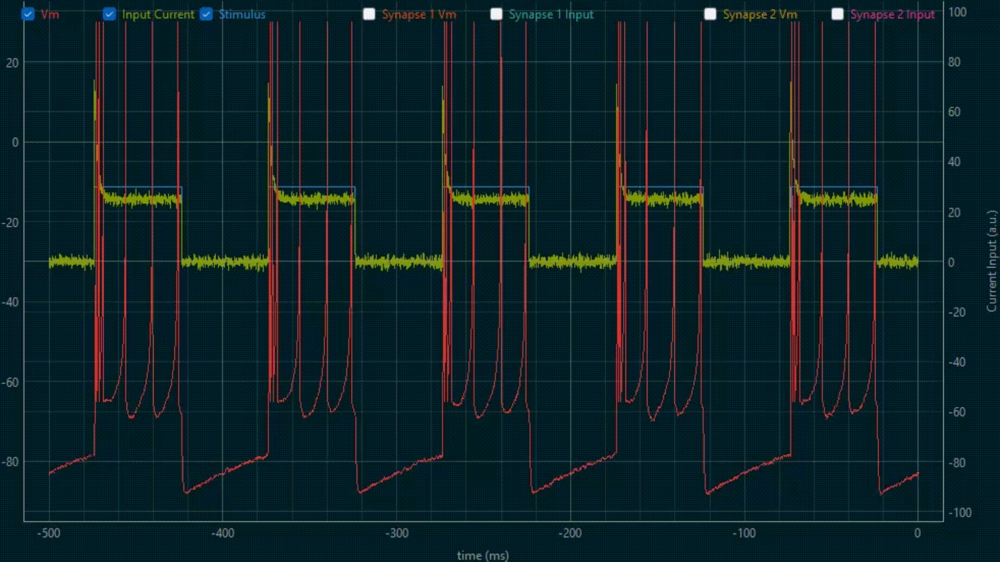

<p style='text-align: justify;'>
  Spikeling is an open-source neuroscience education platform designed to make core neurophysiology concepts teachable through hands-on experimentation, even in settings where traditional wet-lab electrophysiology is impractical.
</p>

<p style='text-align: justify;'>
  In many degree programs, students learn about action potentials and synaptic signalling largely through lectures or static datasets because living preparations, microscopes, amplifiers, and specialist supervision do not scale well to large cohorts. Spikeling addresses this gap with a low-cost “in silico neuron” implemented in hardware.
</p>

<p style='text-align: justify;'>
  The device runs the computationally efficient and versatile <strong>Izhikevich spiking neuron model</strong> in real time on an ESP32-based microcontroller, providing electrophysiology-style interaction: controlled stimulation, measurable membrane-voltage dynamics, spike output, and parameter manipulation to explore firing regimes, adaptation, and input integration.
</p>

<p style='text-align: justify;'>
  A dedicated <strong>cross-platform desktop GUI</strong> supports real-time plotting, experiment control, and recording/export to standard formats—enabling teaching modules that extend beyond neurophysiology into protocol design, data collection, analysis pipelines, and model-based reasoning.
</p>

</div>

<br>

<div align="center">

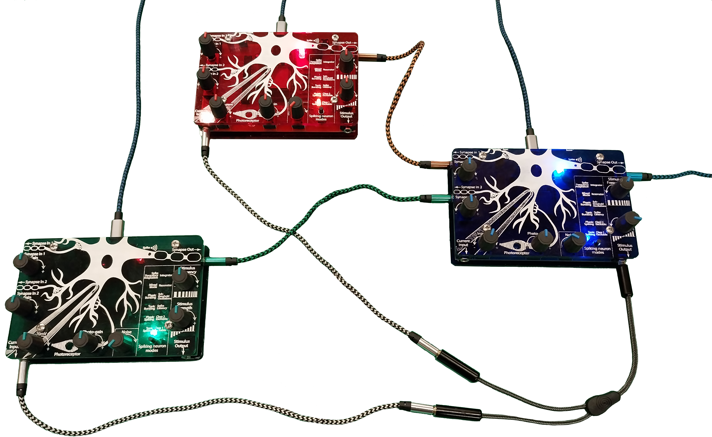

<h6 align="center">Two spikeling units (red and green), that are synchronously stimulated (white cables), synapse with a third unit (blue).</h6>

</div>

---

<div align="center">

## Spikeling in academia & outreach

<p style='text-align: justify;'>
  The spikeling project emerged from local needs to teach neuroscience class modules for direct interaction with <strong>neuron physiology, data analysis, fluorescence imaging, protocol design, etc.</strong>
</p>

<p style='text-align: justify;'>
  The aim was to provide <strong>hands-on experience</strong> on how neurons encode information and how diverse variables modulates their activities, while engaging students with <strong>crucial aspects of data collection, experimental limitations, methodology and statistical analysis.</strong>
</p>

<p style='text-align: justify;'>
  Spikeling is currently used in <strong>university teaching, computational neuroscience training, and outreach events</strong>. It is intentionally <strong>open (hardware + firmware + software)</strong> so educators can customize activities for their courses and contribute back to a shared pool of teaching material.
</p>

<p align="center">
  
</p>

<table>
  <tr>
    <td width="33%">
      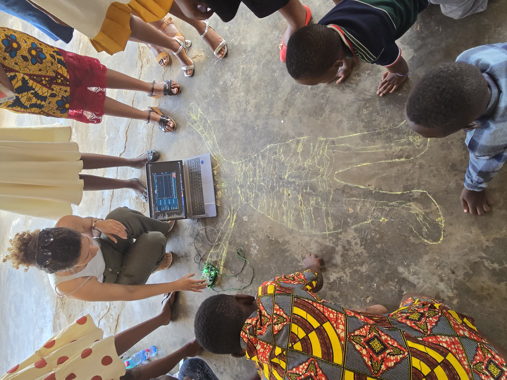<br>
      <sub><b>Outreach demonstration of neuron activities to primary school student in Ghana (2025)</b></sub>
    </td>
    <td width="33%">
      <br>
      <sub><b>Hands-on electrophysiology-style experiments in Zambia (2025)</b></sub>
    </td>
    <td width="33%">
      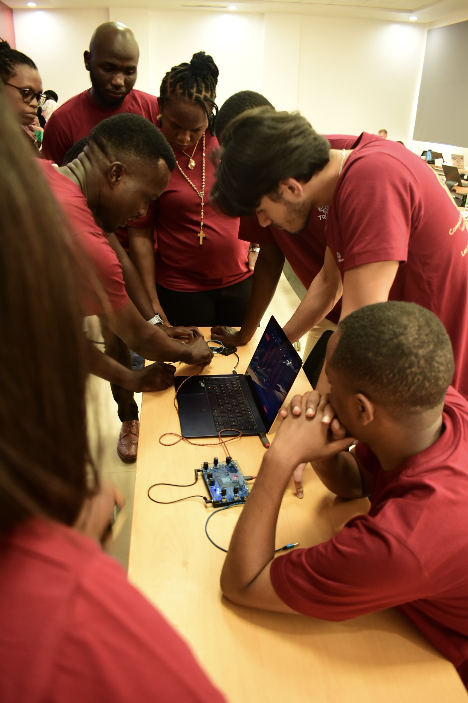<br>
      <sub><b>Small-group protocol design & parameter exploration in Rwanda (2024)</b></sub>
    </td>
  </tr>

</table>

</div>

***

<div align="center">

## A brief summary of Spikeling functions


<h3 align="left"> Neurophysiology:</h3></p>

<p style='text-align: justify;'>
  Spikeling implements the <strong>Izhikevich model</strong>, which “reproduces spiking and bursting behaviour of known type of cortical neurons. The model combines the <strong>biologically plausibility of Hodgkin-Huxley-type dynamics</strong> and the <strong>computational efficiency of integrate-and-fire neurons</strong>” <a href="https://ieeexplore.ieee.org/document/1257420"> E. M. Izhikevich, "Simple model of spiking neurons, 2003"</a>.
  This makes it well-suited for teaching as learners can move quickly between <strong>hypothesis → stimulation → observation → interpretation</strong>.
</p>

<p style='text-align: justify;'>
  Neurophysiology concepts are taught through electrophysiology-style interaction: students apply controlled inputs and directly observe membrane-voltage dynamics,
  thresholding, spike generation, and adaptation. This supports practical teaching objectives such as protocol design, parameter sensitivity, and reproducible experimentation.
</p>

<ul align="left">
  <li>
    <b>Patch-clamp style stimulation (current injection):</b>
    A simulated patch-clamp interface allows students to inject controlled current steps and waveforms.
    Learners can vary <b>amplitude</b>, <b>duration</b>, and <b>timing</b> to explore excitability, threshold, refractory effects, and spike-frequency adaptation.
  </li>

  <li>
    <b>Photo-sensitive input (photodiode / “photoreceptor”):</b>
    Spikeling includes a photodiode input that mimics sensory-driven current input.
    Students can test simple stimuli (e.g., flashlight pulses) and progress to controlled protocols using an external LED driven via the stimulus port
    (frequency/intensity). Advanced discussions can include response dynamics such as effective decay/recovery behaviour under repeated stimulation.
  </li>

  <li>
    <b>Synapses and networks (dendrites + axon):</b>
    Each unit provides <b>two dendritic inputs</b> with gain and polarity control (supporting excitatory and inhibitory effects) and <b>one axonal spike output</b>.
    This enables multi-unit experiments on coincidence detection, inhibition-driven gating, synchrony, and simple network motifs.
    Auxiliary units can be stimulated synchronously to keep network experiments controlled and reproducible.
  </li>
</ul>

<p style='text-align: justify;'>
  Together, these features let students reproduce classic teaching experiments:
  step-current response curves, threshold measurements, adaptation quantification, sensory-driven spiking, and basic synaptic/network computations—using the same device and workflow.
</p>

<br>

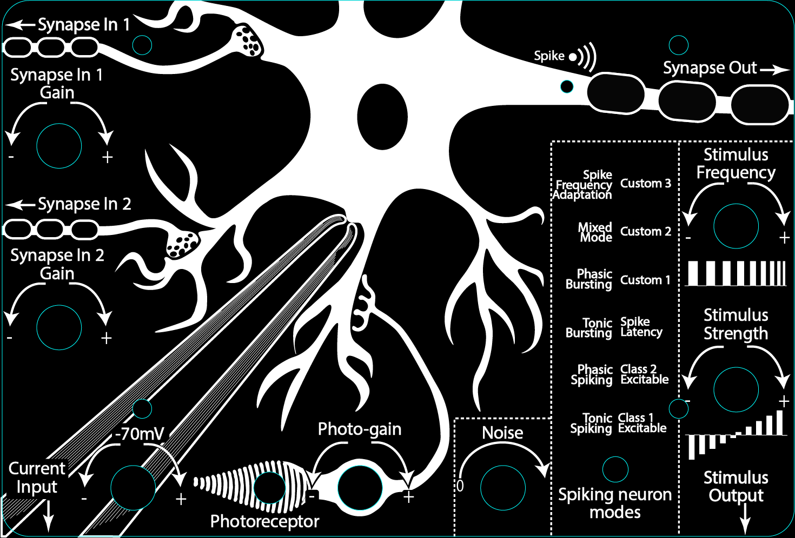
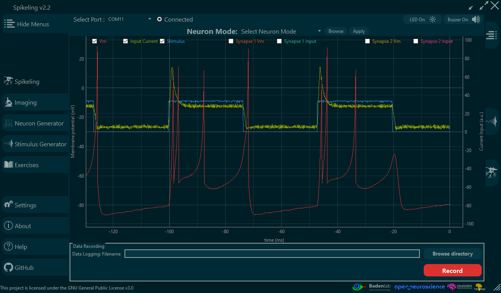

<h6 align="center">Left: Drawing on the acrylic cover of the Spikeling version 2.2, representing the controls knobs along with the input/ouput jacks.

Right: Spikeling GUI displaying the unit membrane voltage (red trace) while being light-stimulated by a controlled LED (blue trace) which generates input current (green trace).
</h6>

</div>

***

<div align="center">

<h3 align="left"> Data analysis</h3></p>

<p style='text-align: justify;'>
  Spikeling is designed to extend practical teaching beyond “watching spikes” into the full experimental workflow:
  <strong>recording</strong>, <strong>quality control</strong>, <strong>basic quantification</strong>, and <strong>export for reproducible analysis</strong>.
  This is particularly valuable in neuroscience curricula where students may have limited exposure to programming and data pipelines, yet are expected to interpret real experimental data.
</p>

<p style='text-align: justify;'>
Any data generated by Spikeling can be <strong>saved and exported</strong> for downstream analysis. The GUI also provides a lightweight,
<strong>built-in analysis</strong> layer that helps students validate recordings and immediately compute core measures such as spike detection and trial-averaged responses.
This supports in-class demonstrations, rapid iteration during labs, and structured home assignments.
</p>

<p style='text-align: justify;'>
  For advanced data analysis and basic statistics, <strong>python notebooks</strong> are provided to serve as template for the teaching staff. We are engage with the Spikeling community where users could share courses, exercises and data analysis scripts to be widely used in neuroscience and coding courses.
</p>

<ul align="left">
  <li>
    <b>Recording & export:</b>
    save time series (e.g., Vm, stimulus, derived currents, triggers) and export to standard formats (e.g., <b>CSV</b>) compatible with Python, MATLAB, R, Excel, etc.
  </li>
  <li>
    <b>Basic QC and annotation:</b>
    quickly verify signal integrity, confirm stimulus timing, and identify artefacts before committing to a full analysis workflow.
  </li>
  <li>
    <b>Spike detection and raster plots:</b>
    detect spikes from membrane-voltage traces and visualize them as rasters to introduce spike trains, variability, and stimulus-locked responses.
  </li>
  <li>
    <b>Trial alignment, looping, and averaging:</b>
    repeat identical stimulus protocols, align trials, and compute averaged traces and spike-rate summaries—making it easy to teach concepts like reliability,
    response variability, and signal-to-noise.
  </li>
  <li>
    <b>Bridge to coding modules:</b>
    provide exported datasets and template <b>Python notebooks</b> so teaching staff can scaffold progressively from GUI-based inspection to student-written analysis code.
  </li>
</ul>

<p style='text-align: justify;'>
  In short, Spikeling supports a gradual learning curve: students can begin with GUI-based inspection and built-in metrics,
  then transition to reproducible, script-based analysis using the exact same datasets—mirroring modern research practice.
</p>
<br>

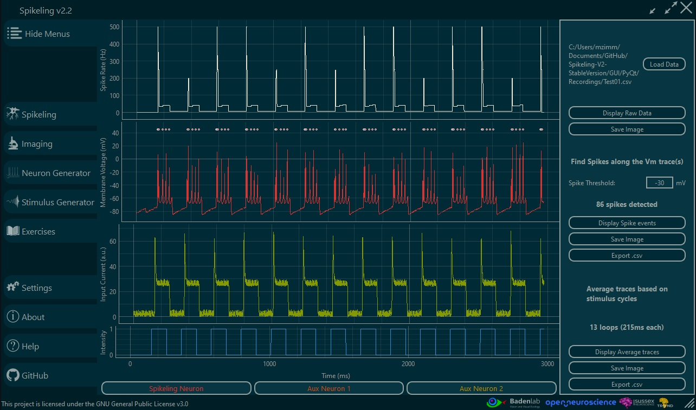


<h6 align="center">Left: Displayed data from the previous experiment (light stimulation) spikes are detected and ploted along the Vm trace (red). Right: Traces looped and averaged showing the spike rate (white), the raster plot (red dots), the averaged Vm recording (red) and the averaged input current (green)</h6>

</div>

***

<div align="center">

<h3 align="left"> Neuron generator</h3></p>


<p style='text-align: justify;'>
  The <strong>Neuron Generator</strong> is an interactive space for exploring the Izhikevich model beyond “playing with a few knobs”.
  It is designed to help students connect <strong>model parameters</strong> to <strong>observable firing behaviours</strong> (e.g., tonic spiking, bursting, adaptation, rebound, irregular firing),
  and to build intuition for how different neurons can emerge from the same compact set of equations.
</p>

<p style='text-align: justify;'>
  In practice, the Neuron Generator lets learners rapidly prototype neuron “types” by adjusting Izhikevich parameters and immediately observing
  how the neuron responds to standardized stimuli. This encourages a scientific workflow: formulate a hypothesis (e.g., “increasing adaptation should reduce firing rate over time”),
  test it with controlled stimulation, then iterate.
</p>

<ul align="left">
  <li><b>Explore firing regimes:</b> interactively vary Izhikevich parameters and observe changes in excitability, thresholding, bursting, and adaptation.</li>
  <li><b>Compare neurons under identical protocols:</b> run the same stimulus recipe on multiple parameter sets to build mechanistic intuition.</li>
  <li><b>Create & share presets:</b> save custom neuron parameter sets for labs, assignments, or reproducible classroom demonstrations.</li>
  <li><b>Bridge theory and experiment:</b> connect equations/parameters to patch-clamp-style readouts (Vm traces, spike trains, firing-rate changes).</li>
</ul>

<br>

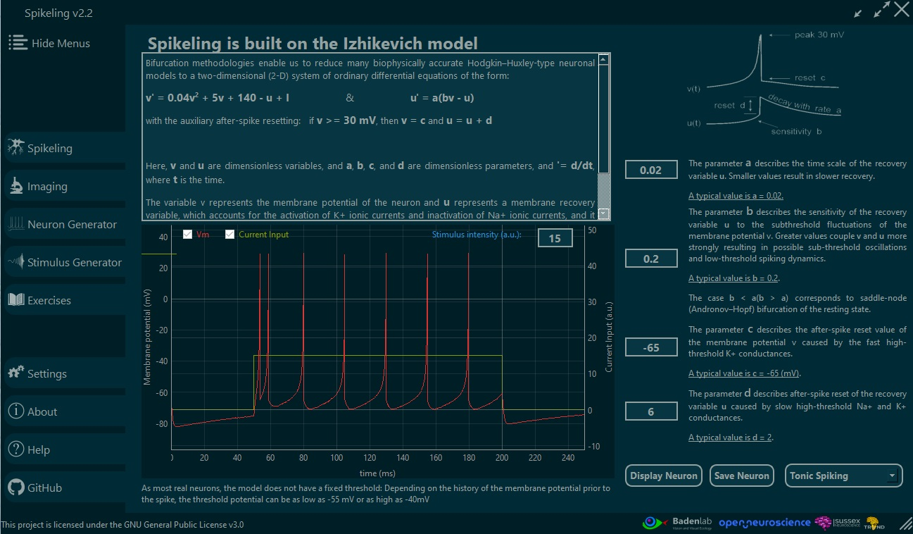

<h6 align="center">GUI displaying the “Neuron Generator” page where users can appreciate the model underlying Spikeling activity and from which they can generate unique neuron to further run on Spikeling.</h6>

</div>

***

<div align="center">

<h3 align="left">Stimulus generator:</h3>

<p style='text-align: justify;'>
  Spikeling includes a dedicated <strong>Stimulus Generator</strong> to teach one of the most important (and often under-taught) parts of experimental neuroscience:
  <strong>protocol design</strong>. While Spikeling board only has a simple repeated square-wave stimulus (useful for classic current-step experiments and LED/light stimulation),
  the Stimulus Generator encourages students to move beyond “turning knobs” and instead design inputs that directly test experimental hypotheses.
</p>

<p style='text-align: justify;'>
  Users can create and iterate custom stimuli—such as <strong>step families</strong>, <strong>sinusoids</strong>, <strong>chirps</strong>, <strong>pulse trains</strong>, and <strong>binary/noise-like</strong> sequences—
  then apply them to current injection or light stimulation. A built-in <strong>stimulus preview</strong> allows learners to verify waveform timing, amplitude, and repetition structure
  <em>before</em> running an experiment, reinforcing good practice around sanity checks and reproducibility.
</p>

<ul align="left">
  <li><b>From standard to custom protocols:</b> start with square pulses and progress to structured waveforms used in electrophysiology and systems neuroscience.</li>
  <li><b>Preview before running:</b> confirm duration, inter-stimulus intervals, amplitude scaling, and repetition count to avoid protocol errors.</li>
  <li><b>Reproducible experimentation:</b> define explicit parameters to enable trial averaging and fair comparisons across neuron modes or conditions.</li>
  <li><b>Hypothesis-driven design:</b> link stimulus structure to questions like threshold, adaptation time constants, resonance, and response reliability under noise.</li>
</ul>

<br>

  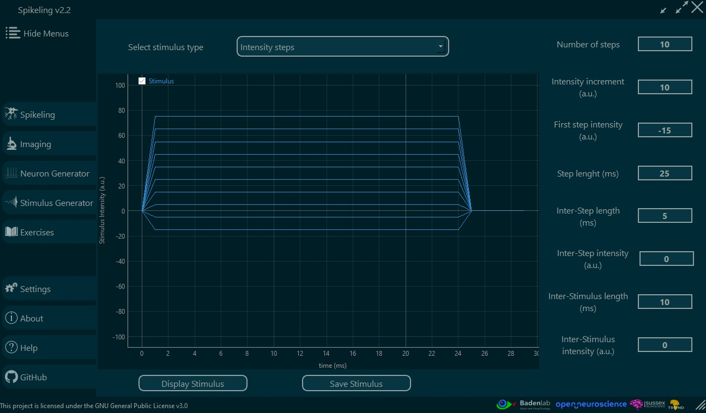
  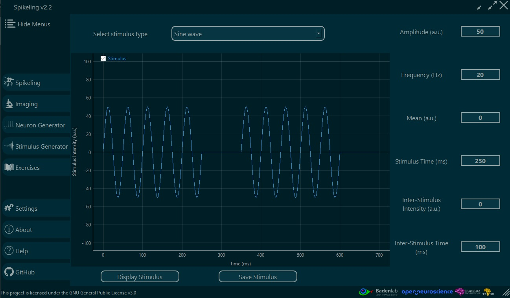

  <h6 align="center">
    Stimulus Generator examples (with preview). Left: classic electrophysiology-style step family (10 steps, 10 a.u. increment, 25 ms per step, 5 ms rest at 0 a.u.).
    Right: sine-wave stimulus (50 a.u. amplitude, 20 Hz, 250 ms duration, 100 ms rest at 0 a.u.).
  </h6>

</div>

***

<div align="center">

<h3 align="left">Multi-recording & networking (multi-unit experiments):</h3>

<p style='text-align: justify;'>
  A key strength of Spikeling is that it can be scaled from a single “neuron” demo to <strong>small, interpretable networks</strong>.
  Each unit provides an <strong>axonal spike output</strong> and two <strong>dendritic (synaptic) inputs</strong>, enabling multiple Spikelings to be physically connected
  and studied as a functional circuit. This makes it possible to teach network-level computation using the same workflow as single-cell experiments:
  controlled stimulation, direct observation, and quantitative comparison.
</p>

<p style='text-align: justify;'>
  Importantly, each synaptic input can be configured as <strong>excitatory or inhibitory</strong> (via the synaptic gain control), allowing learners to explore
  how the <strong>sign</strong> and <strong>strength</strong> of coupling shapes membrane dynamics and spiking output. The GUI supports <strong>multi-recording</strong> by plotting and saving,
  in the same session, the activity of the main unit alongside the incoming synaptic streams (and, when available, the associated presynaptic signals),
  which is essential for teaching causality, timing, and interaction effects.
</p>

<ul align="left">
  <li><b>Excitation vs inhibition:</b> set synaptic gain positive or negative to illustrate recruitment of spiking vs suppression/gating.</li>
  <li><b>Timing-dependent effects:</b> compare synchronous vs offset inputs to demonstrate coincidence detection and integration windows.</li>
  <li><b>Simple circuit motifs:</b> build and test canonical motifs (feedforward excitation, inhibitory gating, E/I balance, two-input integration).</li>
  <li><b>Multi-channel recording:</b> visualize and export multiple traces simultaneously (main Vm, stimulus, synaptic inputs, and optional partner activity) for downstream analysis.</li>
</ul>

<br>

<div>
  <!-- Rename/move these screenshots into your repo (recommended location: ./Documentation/Images/ ) -->
  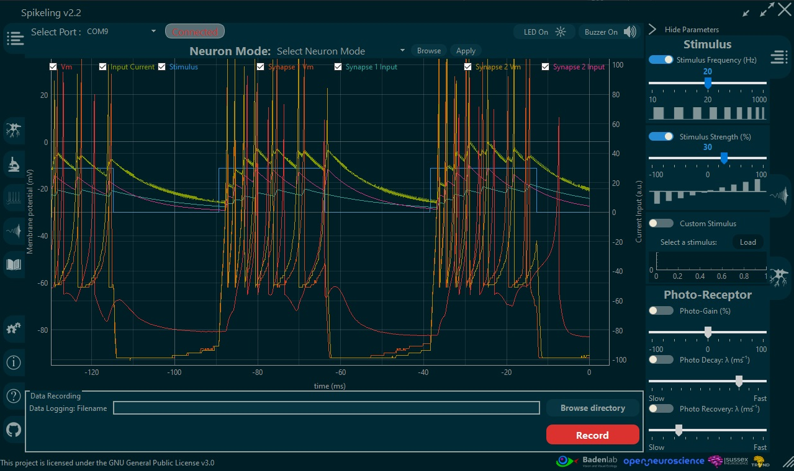
  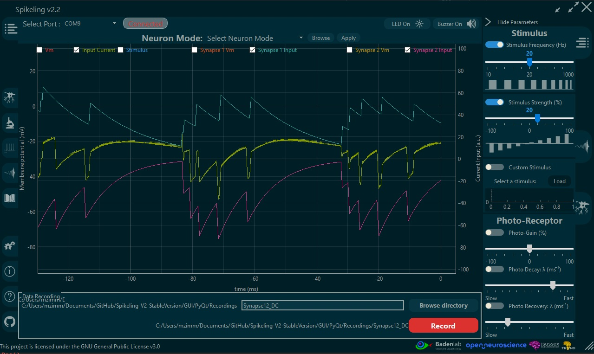

  <h6 align="center">
    Multi-unit / synaptic networking example recorded in the GUI.
    Left: <b>excitatory</b> synaptic drive increases firing probability and can recruit spikes in the postsynaptic neuron.
    Right: <b>inhibitory</b> synaptic drive suppresses spiking and gates responses despite ongoing stimulation.
    In both cases, synaptic streams and membrane activity are visualised together, enabling direct comparison of circuit configurations.
  </h6>

</div>

---

<div align="center">

<h3 align="left">Fluorescence imaging simulation:</h3>

<p style='text-align: justify;'>
  Because Spikeling produces real-time <strong>membrane-voltage</strong> traces (and therefore a known spike train), it provides an ideal “ground truth” signal
  to introduce students to <strong>calcium imaging</strong> and the relationship between spikes, intracellular calcium dynamics, and measured fluorescence.
  The GUI can transform spiking activity into a simulated <strong>calcium concentration transient</strong>, and then into a simulated <strong>fluorescence signal</strong>,
  allowing learners to explore how imaging readouts relate to the underlying electrophysiology.
</p>

<p style='text-align: justify;'>
  Students can manipulate variables that mirror real experimental constraints—both on the acquisition side (e.g., <strong>frame rate</strong>, <strong>detector gain</strong>, <strong>noise level</strong>)
  and on the biophysical/indicator side (e.g., <strong>baseline calcium</strong>, <strong>decay time constant</strong>, <strong>spike-triggered calcium increment</strong>,
  <strong>indicator affinity / dissociation constant</strong>, <strong>brightness</strong>, and <strong>photobleaching-like effects</strong>).
  This helps learners understand why calcium traces are not a direct copy of spikes, and why interpretation depends on both biology and measurement.
</p>

<p style='text-align: justify;'>
  For increased realism, the simulation can be switched from a <strong>linear</strong> fluorescence model to a <strong>non-linear saturating</strong> model,
  illustrating common limitations such as dynamic range, saturation at high activity, and the consequences for comparing firing rates across conditions.
</p>

</div>

<br>

<div>
  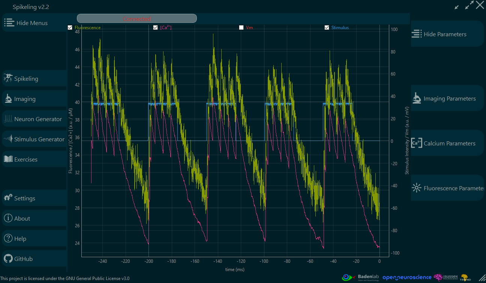
  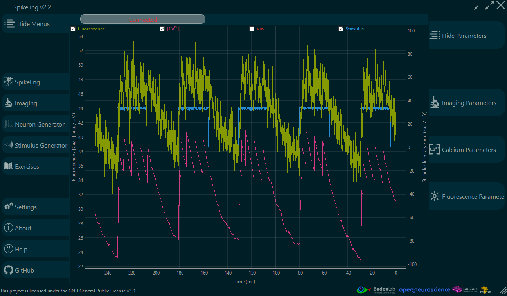

  <h6 align="center">
    Imaging simulation in the GUI: linear (left) and saturating / non-linear (right) fluorescence models (green) generated from simulated calcium concentration dynamics (pink).
  </h6>

  <p style='text-align: justify;'>
    The objective is to familiarise students with the type of data they will encounter in modern systems and circuit neuroscience:
    signals that are <strong>indirect</strong>, <strong>noisy</strong>, and shaped by both the underlying biology and the measurement apparatus.
    This creates a natural pathway to discussing experimental limitations (sampling, noise, saturation, bleaching) and good analysis practice.
  </p>

  <p style='text-align: justify;'>
    In advanced modules, students can analyse the simulated imaging data and implement <strong>spike inference</strong> methods, then directly compare inferred spikes
    to the known “ground truth” spike train that generated the fluorescence trace—turning a common challenge in imaging into a controlled, teachable problem.
  </p>

</div>

***

<h3 align="left">Exercises:</h3>

<p style='text-align: justify;'>
  Spikeling is accompanied by a set of <strong>suggested exercises</strong> designed to help teaching staff run structured practicals with minimal setup.
  The exercises are intended to create a concrete bridge between core neurophysiology concepts taught in lectures and a responsive, real-time <strong>in silico</strong> neuron model
  that students can stimulate, measure, and analyse.
</p>

<p style='text-align: justify;'>
  Beyond technical skills, the exercises are also a vehicle for introducing scientific reasoning and epistemology:
  how a concept becomes knowledge, what it means to test a hypothesis, and how results can <strong>support, constrain, or falsify</strong> an interpretation.
  In advanced modules, students can be asked to design their own experiment as an assignment—emphasising good practice in <strong>methodology</strong> and <strong>protocol design</strong>
  (controls, parameter choices, repeatability, and appropriate analysis), rather than treating “methods” as a checklist.
</p>

<ul align="left">
  <li><b>Ready-to-run practicals:</b> structured activities covering excitability, threshold, adaptation, synaptic integration, and basic networks.</li>
  <li><b>Analysis-focused assignments:</b> exported datasets for plotting, spike detection, summary metrics, and interpretation.</li>
  <li><b>Open-ended projects:</b> student-designed stimuli and protocols to answer a defined question (with clear evaluation criteria).</li>
</ul>

<p style='text-align: justify;'>
  We encourage educators to adapt and extend these exercises to match their curricula. Our goal is to grow a shared pool of teaching material where users can contribute
  new exercises, datasets, and analysis notebooks—making Spikeling progressively more useful across institutions and course formats.
</p>


***

<br>

<h2 align="center">Detailed Spikeling functions</h3></p>

<br>

- [Spikeling: A spiking neuron interface](#a-spiking-neuron-interface)
- [Spikeling: GUI - neuron parameters](#spikeling-gui-neuron-parameters)
- [Spikeling: GUI - stimuli parameters](#spikeling-gui-stimuli-parameters)
- [Spikeling: Data Analysis](#-data-analysis)
- [Spikeling: Neuron generator](#spikeling-neuron-generator)
- [Spikeling: Stimulus Generator](#stimulus-generator)
- [Spikeling: Multiple recording](#spikeling-multiple-recording)

<br>

- [Fluorescence: imaging simulation](#fluorescence-imaging-simulation)
- [Fluorescence: Imaging parameters](#fluorescence-imaging-parameters)
- [Fluorescence: Calcium parameters](#fluorescence-calcium-parameters)
- [Fluorescence: Fluorescence parameters](#fluorescence-imaging-parameters)
- [Fluorescence: Data Analysis](#fluorescence-data-analysis)
- [Fluorescence: Multiple fluorescence](#fluorescence-multiple-fluorescence)

<br>

- [Exercices: GUI](#exercises-gui)
- [Exercices: Python](#exercises-python)

<br>

- [GitHub Contributions](#gitHub-Contributions)

- [Arduino code and libraries](#)

- [GUI PyQt6 / PySide6 script](#)

<br>

***

<br>

## A spiking neuron interface

<br>

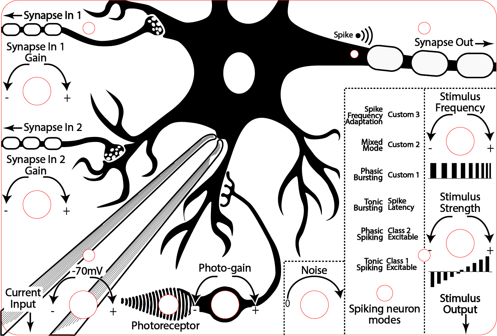

<p style='text-align: justify;'>
The entire layout of the Spikeling board has been reconceived and a laser-cut acrylic sheet repesenting a neuron now sits on top of the board. All ports and potentiometers are now strategically placed.

<p style='text-align: justify;'>
The ESP32 is placed below the soma, the synaptic inputs from other Spikeling units are placed on the left, the synaptic output is placed on the right. Along the axon now sits a RGB LED, the red LED brightness follows as before the Vm status of the neuron, and the LED sparks in white when the neuron spike. The spike buzzer also sit along the axon, a small hole on the acrylic sheet sitting just above so the click can be heard coming from that direction. Both indicators can now be disabled by users at their pleasure.

<p style='text-align: justify;'>
The Vm potentiometer and the Current-in port are now grouped together and sit on the acrylic sheet at the bottom of an electrode pipette. They can now be considered as patch clamp experiment variables.

<p style='text-align: justify;'>
A photoreceptor is now drawn on the acrylic sheet, below the opsin sits a photodiode, and a potentiometer on the photoreceptor body now controls the photoreceptor sensitivity and its polarity (users can thus decide if the photoreceptor has an excitatory or an inhibitory effect on the neuron)

<p style='text-align: justify;'>
The noise potentiometer now sits in a box by itself as it represents parasitic noise from the experiment environment (synaptic inputs, receptor noise, thermal noise, experimental setup, etc.) and is independent from the rest of the Spikeling functions. This potentiometer is different from the others: it is not center-detented as it generates noise from a zero to a maximum value.

<p style='text-align: justify;'>
Next is the Neuron mode box which contains the twelve available modes to the users and a push button that allows the user to switch between them.

<p style='text-align: justify;'>
Finally, the last box contains all experimental tools allowing stimuli generation. As detailed on the acrylic top cover, the user can control the stimulus frequency and the stimulus intensity, along with its polarity. The stimulus output can either be directly connected to the current-in port to simulate a current applied to a patched neuron through the pipette; or be connected to a cable with a 5mm LED soldered at its tip which can be placed directly on top of the photoreceptor opsin (photodiode below). The photoreceptor potentiometer allows to modulate the gain and polarity of the light-induced input current. Furthermore, the photoreceptor possesses functions (on the GUI: decay/recovery) simulating how a variety of photoreceptors would integrate a light stimuli and how it will adapt to prolonged stimulation.  


<br>

***

<br>

<p style='text-align: justify;'>
Spikeling now possesses its own GUI, written in python and using the latest PyQt6/PySide6 library. The script then uses pyInstaller so it can be translated into a windows/linux/mac app, ready to be easily distributed to users.

<br>


<p style='text-align: justify;'>
The GUI is divided into distinct pages. The first one is the main GUI window where users connect the board to the computer. From there they can choose to either select the neuronal mode on the board directly (neuron mode box) or through the GUI (note that custom modes will have to be selected from here, and in this instance the GUI takes priority over the board commands).

<p style='text-align: justify;'>
The main window displays the Spikeling activity (Neuron Vm, total current input from all sources & stimulus ). If connected to other Spikelings, the GUI can display synaptic inputs: their incoming neuron Vm and their spiking events, which will be translated into input current for the main neuron. Traces can be selected through checkbox and superimposed over the same graph with a common timeline.

<p style='text-align: justify;'>
The "Neuron Mode" defines the current Izhikevich model being used [see Neuron Generator](#Spikeling-Neuron-generator). Twelve are encoded by default on the Spikeling unit and can be chosen either from the board itself or directly from the GUI: "Select Neuron Mode". Note that any command from the GUI will take priority over the board. Custom Neuron Modes can be selected from here and upload to the board.

<p style='text-align: justify;'>
The neuron interface page also possesses two buttons to enable/disable the spike buzzer sound and the spike LED, which in a class room full of spikeling, are regarded as huge relieves.

<p style='text-align: justify;'>
Below the main window, sits the recording window. All last generated data from traces that are checked on the main window will be saved in a .csv format.

<p style='text-align: justify;'>
On the right hand side two control columns can be found. For all commands, when the toggle button is enabled, the GUI takes over the potentiometer and controls directly the Spikeling variables. This allows users to design an experimental protocol in a controlled fashion.

<br>

***

<br>

<p style='text-align: justify;'>
Spikeling membrane voltage (Vm), displayed on the GUI in red, is generated by the Izhikevich model equation.
It is rather simple and relies on four parameters [see Neuron Generator](#Spikeling-Neuron-generator).

<br>

<p style='text-align: justify;'>
When Vm > 30mV, then a spike is generated, both the spike LED and spike buzzer on the board are activated, and the Vm model is reset accordingly (see above).

<p style='text-align: justify;'>
The green trace represents all current inputs received by the board and summed up in the variable "I" in the Izhikevich equation.
These current inputs correspond to the synaptic inputs, the direct current injection from the patch clamp port or the light induced current from the photodiode, and the noise generator potentiometer. All will influence the Vm equation and the subsequent spiking pattern.

<p style='text-align: justify;'>
The blue trace represents the square wave stimulus, which can be manually modulated in length, intensity and polarity through the potentiometer located in the "experiment box". The resulting stimulus signal is sent to the "Stimulus Output" port.
A jack cable connecting the "Stimulus Output" port to the "Current In" port will deliver the stimulus signal directly into the Spikeling neuron, simulating a direct current injection through a patched clamp electrode.
If a LED is connected to the "Stimulus Output" port and placed onto the photodiode, then the "photoreceptor" is stimulated accordingly and generates a current that will in turn be injected into the Izhikevich equation.

<p style='text-align: justify;'>
Users can also interact with the "Current In" potentiometer placed on the electrode and constantly inject steady current in order to either hyperpolarise or depolarise Spikeling.
Users can also interact with the "Photo-Gain" potentiometer and modulate the light sensitivity and polarity of the photodiode, thus generating ON/OFF neurons.

<p style='text-align: justify;'>
If Spikeling is connected to other units, the main window can display their Vm and their synaptic current inputs. Users can modulate these inputs by interacting with the "Synapse Gain" potentiometers which modulate the intensity and polarity of the synaptic inputs, giving rise to excitatory and inhibitory synapses.

<p style='text-align: justify;'>
Furthermore, users can stimulate the auxiliary Spikeling units in synchrony via the main unit's "Stimulus Output" port by using a splitter audio jack

<br>

***

<br>

## Spikeling GUI neuron parameters

<br>

TBC

<br>

***

<br>

## Spikeling GUI stimuli parameters

<br>

TBC

<br>

***

<br>

## Spikeling Neuron generator

<br>


<p style='text-align: justify;'>
Spikeling GUI comes with a "Neuron Generator" page where users can interact with the Izhikevich equation, understand the model generating Spikeling membrane voltage, and create their own "neuron mode" to be loaded on the main page.

<p style='text-align: justify;'>
The main window computes the Izhikevich model with a modifiable current input. Users can change the 4 variable of the code and display the resulting "neuron mode". This is also where users can come up with their own neuronal modes to experiment on. This is also where teachers can generate their own custo-made neuron, save them, and impose them as experimental model for, i.e. home assignments.

<p style='text-align: justify;'>
From <a href="https://pubmed.ncbi.nlm.nih.gov/18244602">Izhikevich publication</a>:
<em> Bifurcation methodologies enable us to reduce many biophysically accurate Hodgkin–Huxley-type neuronal models to a two-dimensional (2-D) system of ordinary differential equations of the form:</em>

```math
v' = 0.04v^2 + 5v + 140 - u + I
```
```math
u' = a * (bv - u)
```

With the auxiliary after-spike resetting:

<p align="center">
if:
</p>

```math
v >= 30mV
```
<p align="center">
 then:
 </p>

 ```math
 v = c
 ```

<p align="center">
 and:
 </p>

 ```math
 u = u + d
```

<br>

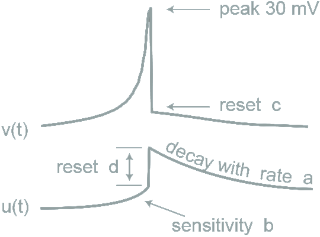

<p style='text-align: justify;'>
Here, v and u are dimensionless variables, and a, b, c, and d are dimensionless parameters, and '= d/dt, where t is the time (0.1 µs).

<p style='text-align: justify;'>
The variable v represents the membrane potential of the neuron and u represents a membrane recovery variable, which accounts for the activation of K+ ionic currents and inactivation of Na+ ionic currents, and it provides negative feedback to v.

<p style='text-align: justify;'>
After the spike reaches its apex (+30 mV), the membrane voltage and the recovery variable are reset.
Synaptic currents or injected DC-currents are delivered via the variable I.

<p style='text-align: justify;'>
Below the stimulus frequency and strength sliders can be found a custom stimulus display. Here the user can choose to use instead of the classical square wave, either a stimulus from a pre-design library (comprising sine wave, chirp, white noise, etc.), or either a custom made stimulus generated from the GUI "stimulus generator" tab.

<br>

***

<br>

## Spikeling Stimulus Generator

<br>

<p style='text-align: justify;'>
Spikeling GUI also comes with a "Stimulus Generator" page where users can generate their own stimuli. In the current version seven distinct stimulus pattern are available with various parameters to interact with.
All stimuli can then be saved and further loaded from the Spikeling main window.

<br>

<div>


<h6 align="center">GUI displaying the “Simulus Generator” page where users can generate their own unique stimuli. The left screen shows repetitive increments of current, as seen in classic electrophysiology experiments (10 steps with 10 a.u. current increment lasting 25 ms with a resting period of 5ms at 0 a.u. current). The right screen shows a sine wave stimulus (50 a.u. amplitude, 20 Hz frequency over a period of 250 ms and a resting period of 100 ms at 0 a.u. current)</h6>

</div>

<br>

<div>

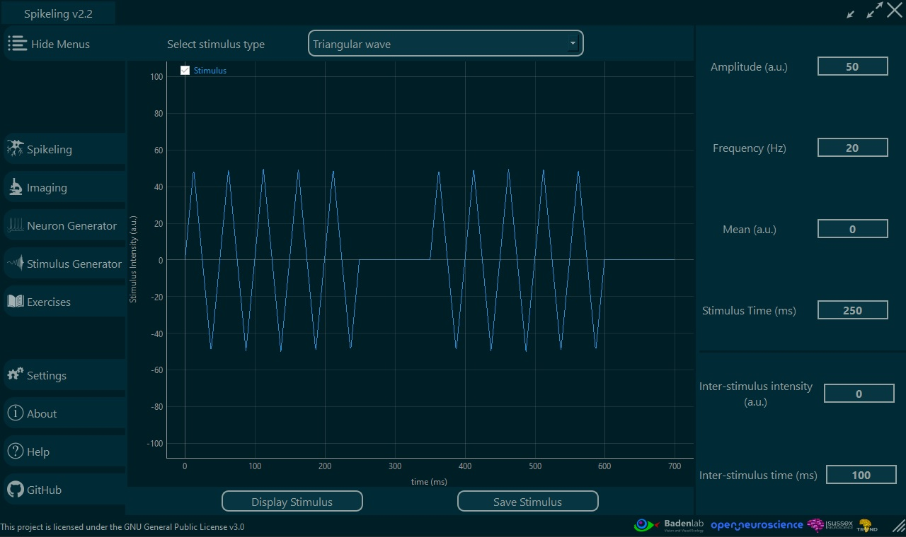

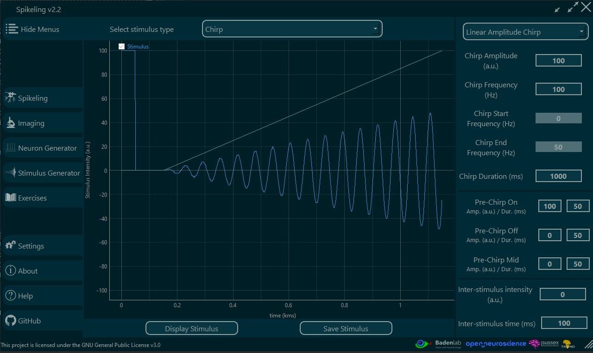

<h6 align="center">GUI displaying the “Simulus Generator” page where users can generate their own unique stimuli. The left screen shows a triangular wave stimulus (50 a.u. amplitude, 20 Hz frequency over a period of 250 ms and a resting period of 100 ms at 0 a.u. current). The right screen shows a chirp stimulus with an increased intensity from a 0 to a 100 a.u. amplitude at 100 Hz over 1000 ms </h6>

</div>

<br>

<div>

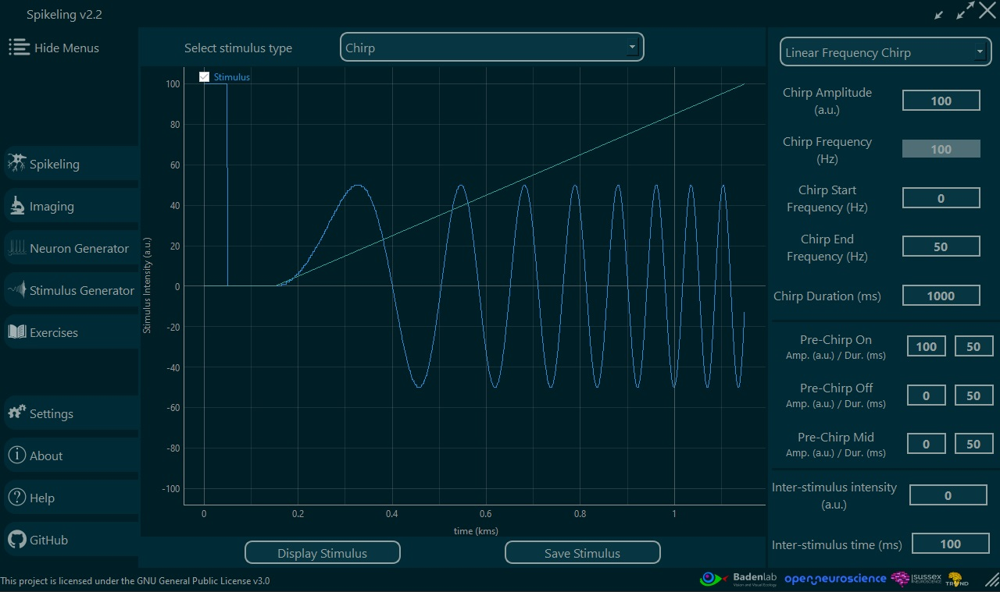

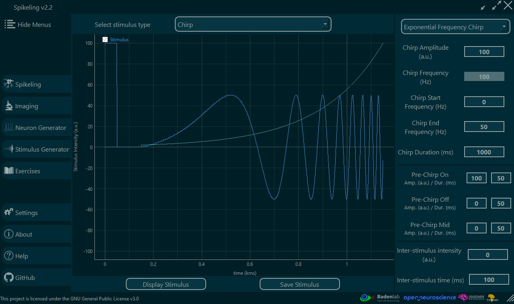

<h6 align="center">GUI displaying the “Simulus Generator” page where users can generate their own unique stimuli. The left screen shows a linear chirp stimulus with an increased frequency from a 0 to a 50 Hz with an amplitude of 100 a.u. over 1000 ms. The right screen show the same stimulus with an exponential frequency increase </h6>

</div>

<br>

***

<br>

## Spikeling Multiple recording

<br>

TBC

<div>

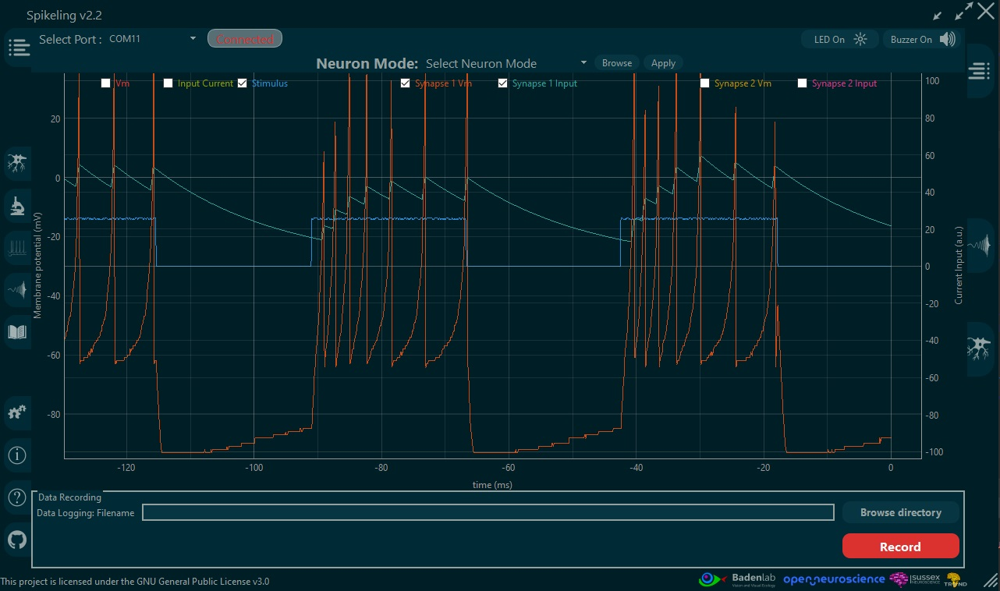

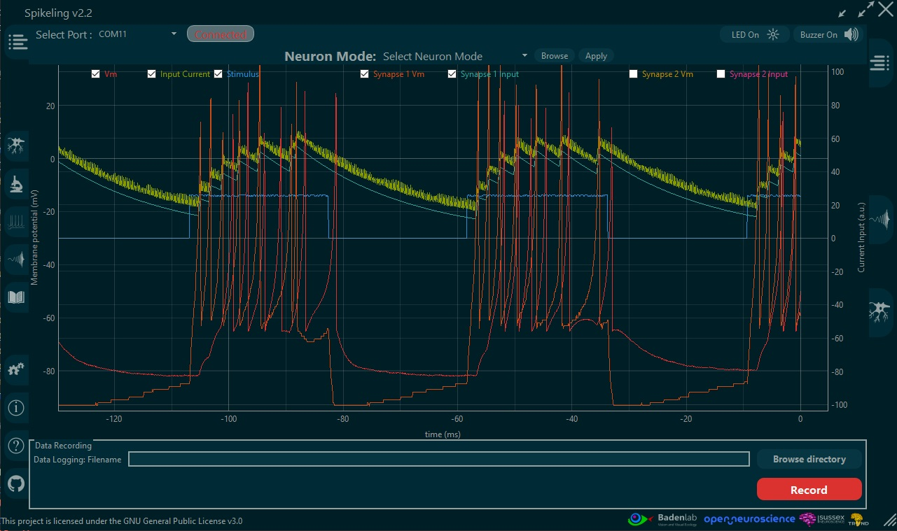

<h6 align="center"> ... </h6>

</div>

<br>

<div>


<h6 align="center"> ... </h6>

</div>

<br>

***

<br>

## Fluorescence Imaging simulation

<br>

TBC

```math
[Ca^{2+}]_{t} = [Ca^{2+}]_{t-1} - \tau . [Ca^{2+}]_{t-1} + [Ca^{2+}]_{b} + A . n_{t} + \sigma_{Ca} . \sqrt{\Delta} . \varepsilon_{Ca,t}
```

Where:
- $\tau$ is the Calcium decay constant
- $[Ca^{2+}]_{b}$ the Calcium baseline concentration
- A is the calcium concentration jump each spike triggers
- $n_{t}$ is the number of spikes at time t
- $\sigma_{Ca}$ scales the Calcium noise
- $\Delta$ represents the imaging frame timeline
- $\varepsilon_{Ca,t}$ is a standard normal Gaussian noise source

<br>

```math
F_{t} = \alpha[Ca^{2+}]_{t} + \beta + \sigma_{F}.\varepsilon_{F,t}
```

<br>

<div>
<p align="center">


</div>

<br>

Where:
- $\alpha$ scales the Fluorescence
- $\beta$ offsets the fluorescence
- $\sigma_{F}$ scales the Fluorescence noise
- $\varepsilon_{F,t}$ is a standard normal Gaussian noise source


<br></br>

```math
Fsat_{t} = \alpha.S.[Ca^{2+}]_{t} + \beta + \eta_{t}

```

Where:
- The gain $\alpha$ scales the fluorescence. It accounts for all factors contributing to signal amplification, including the number of fluorophores in the neuron, the brightness of each fluorophore, the gain of the image acquisition system, etc.
- The offset $\beta$, accounts for any factor leading to a constant background signal, such as baseline fluorescence.
- $S . [Ca^{2+}]_{t}$ is a nonlinear saturation function, often taken as the Hill equation:
  - $S_{x} = \frac{x_{n}} {(x_{n} + kd)}$, where n is the Hill coefficient and kd the dissociation constant.
- Assuming the primary noise source is photon shot noise, it would be appropriate to model noise as a Poisson process, which could be well approximated by a Gaussian distribution for large photon counts: $\eta_{t}$

```math
\eta_{t} = \sqrt{\varepsilon.S . ([Ca^{2+}]_{t}) + \sigma_{F}} . \varepsilon_{F,t}
```

<br>


<div>

<p align="center">


</div>

<br>

***

<br>

## Fluorescence Imaging parameters

<br>

TBC

<br>

***

<br>

## Fluorescence Calcium parameters

<br>

TBC

<br>

***

<br>

## Fluorescence Imaging parameters

<br>

TBC

<br>

***

<br>

## Fluorescence Data Analysis

<br>

TBC

<br>

***

<br>

## Fluorescence Multiple fluorescence

<br>

TBC

<br>

***

<br>

## Exercises GUI

<br>

TBC

<br>

***

<br>

## Exercises Python

<br>

TBC

<br>

***

<br>

## GitHub Contributions

<br>

TBC

<br>

## Documentation

The full documentation is hosted as a project wiki and is the recommended entry point for educators and new users.

It covers:
- **Getting started** (hardware overview, connections, first experiment)
- **Firmware** (flashing, configuration, serial protocol)
- **GUI user guide** (controls, plotting, recording/export, troubleshooting)
- **Teaching materials** (suggested lab exercises, workflows, assignments)
- **Advanced modules** (synapses/networks, stimulus design, fluorescence imaging simulation, emulator mode)

**Docs website:** https://opensourceneuro.github.io/Spikeling/  
**Firmware documentation:** https://opensourceneuro.github.io/Spikeling/Firmware/Spikeling_V3  
**Releases (pre-built GUI):** https://github.com/OpenSourceNeuro/Spikeling/releases
