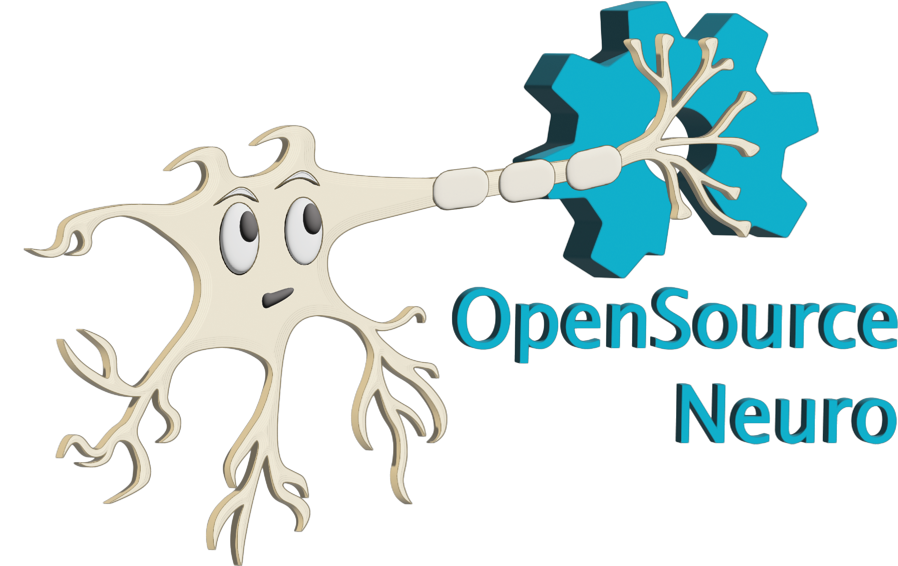

<p align="left">
  
</p>

<div align="center">

# **Software applications, GUI, and development setup**

<p>
  <a href="../LICENSE.txt">
    
  </a>
  <a href="https://github.com/OpenSourceNeuro/Spikeling/releases">
    
  </a>
  <a href="../Software/GUI%20-%20PyQt6-PySide6">
    
  </a>
  <a href="../Software/App%20-%20AndroidStudioProjects">
    
  </a>
</p>

</div>

This folder contains the **software side of Spikeling**. At present, it is split into two main application tracks:

- a **cross-platform desktop GUI** built with **PyQt6 / PySide6**
- an **Android Studio mobile application project**

The desktop GUI is the main user-facing application used to communicate with Spikeling hardware, visualise data streams, configure experiments, and export recordings. The Android project is provided separately for mobile-oriented development.

**Quick links**
- [Main repository](../)
- [Firmware folder](../Firmware)
- [Hardware folder](../Hardware)
- [Documentation folder](../Documentation)
- [Desktop GUI source](./GUI%20-%20PyQt6-PySide6)
- [Android Studio project](./App%20-%20AndroidStudioProjects)
- [Project documentation](https://opensourceneuro.github.io/Spikeling/)
- [Releases](https://github.com/OpenSourceNeuro/Spikeling/releases)

<p align="right">
  developed by M.J.Y. Zimmermann<br>
  maintained by P. Rignanese & A. Koumoundourou<br>
  based on an original idea by T. Baden
</p>

---

## **1. What this folder contains**

The `Software` folder groups the applications used to interact with Spikeling hardware and its teaching workflows.

### **Current subfolders**
- [`GUI - PyQt6-PySide6`](./GUI%20-%20PyQt6-PySide6)  
  Main desktop application for Windows, macOS, and Linux
- [`App - AndroidStudioProjects`](./App%20-%20AndroidStudioProjects)  
  Android Studio project for mobile development

---

## **2. Software overview**

### **Desktop GUI**
The desktop GUI is the central application for most Spikeling users. It is designed for:

- real-time signal visualisation
- experiment control
- serial communication with the device
- stimulus generation
- data recording and export
- teaching workflows spanning electrophysiology, imaging, and analysis

### **Android app**
The Android project is a separate software track intended for mobile development and Android-based use cases. It is stored as a standard Android Studio / Gradle project.

> For most users, the desktop GUI is the primary entry point. The Android project is best treated as a developer-oriented companion project unless your workflow specifically targets Android devices.

---

## **3. Desktop GUI structure**

The desktop application currently lives in:

- [`./GUI - PyQt6-PySide6`](./GUI%20-%20PyQt6-PySide6)

Its structure shows a modular design with separate pages and graph logic for different parts of the Spikeling ecosystem.

### **Main entry points and core files**
- `Main.py`
- `serial_manager.py`
- `Spikeling_UI.py`
- `Spikeling_UI.ui`
- `resources.qrc`
- `resources_rc.py`

### **Graph / acquisition modules**
- `Graph_Spikeling.py`
- `Graph_Imaging.py`
- `Graph_ExtraCellular.py`
- `Graph_Emulator.py`

### **GUI page modules**
- `Page_Home.py`
- `Page_About.py`
- `Page_Settings.py`
- `Page_GitHub.py`

### **Neuron / experiment pages**
- `Page_Spikeling_NeuronInterface.py`
- `Page_Spikeling_NeuronEmulator.py`
- `Page_Spikeling_DataAnalysis.py`
- `Page_StimulusGenerator.py`
- `Page_NeuronGenerator.py`
- `Page_NeuronParameters.py`

### **Imaging pages**
- `Page_Imaging_ImagingSimulation.py`
- `Page_Imaging_DataAnalysis.py`
- `Page_Imaging_Tutorial.py`

### **Extracellular pages**
- `Page_ExtraCellular_Scope.py`

### **Supporting parameter modules**
- `Parameters_Izhikevich.py`
- `Parameters_GECI.py`
- `Parameters_Settings.py`
- `Parameters_Sliders.py`
- `Parameters_ToggleButtons.py`
- `Parameters_NavigationButtons.py`

### **Bundled resources / user content folders**
- `Neurons`
- `Stimuli`
- `Recordings`
- `resources`

This structure makes it clear that the GUI is not just a serial monitor: it is a full teaching and experiment environment covering live neuron interaction, stimulus design, imaging simulation, extracellular/tetrode simulation, and data analysis.

---

## **4. Android project structure**

The Android application currently lives in:

- [`./App - AndroidStudioProjects`](./App%20-%20AndroidStudioProjects)

This folder contains a standard Android Studio / Gradle project layout, including:

- `app/`
- `gradle/`
- `build.gradle.kts`
- `settings.gradle.kts`
- `gradle.properties`
- `gradlew`
- `gradlew.bat`

This means Android development is organised as a separate native application project rather than being embedded inside the Python GUI codebase.

---

## **5. Desktop GUI dependencies**

The current pinned Python dependencies listed in `GUI - PyQt6-PySide6/requirements.txt` are:

```text
PySide6==6.9.2
numpy==2.3.2
pandas==2.3.2
pyinstaller==6.15
pyqtgraph==0.13.7
scipy==1.16.1
```

These dependencies reflect the current desktop software stack:

- **PySide6** for the Qt-based GUI
- **pyqtgraph** for fast scientific plotting
- **numpy / scipy** for numerical processing
- **pandas** for tabular data handling and export workflows
- **pyinstaller** for packaging distributable desktop applications

---

## **6. Platform packaging**

The desktop GUI folder includes dedicated PyInstaller spec files for the main desktop operating systems:

- `Spikeling-win.spec`
- `Spikeling-mac.spec`
- `Spikeling-linux.spec`

This means the repository is already organised for cross-platform packaged builds, not only source-based execution.

If you are building from source, these spec files are useful references for:
- included resources
- packaging behaviour
- OS-specific build workflows

---

## **7. Releases and pre-built software**

Pre-built software packages are distributed through the project’s GitHub releases page:

- [Spikeling releases](https://github.com/OpenSourceNeuro/Spikeling/releases)

This is the recommended entry point for users who want to install the GUI without setting up a local Python environment.

If you are a contributor or developer, the source folders in this directory provide the editable codebase used to create those packaged releases.

---

## **8. What the desktop software is used for**

The desktop GUI extends Spikeling beyond simple live monitoring. Based on the current repository structure and project documentation, the software supports workflows such as:

- live membrane voltage and spike visualisation
- serial communication with Spikeling hardware
- data recording and export
- built-in data analysis pages
- neuron parameter editing
- custom stimulus generation
- neuron emulation
- fluorescence imaging simulation
- extracellular / tetrode-style simulation
- tutorial and teaching pages

This architecture is particularly important for teaching, because it lets students move from **stimulation** to **recording** to **analysis** in one interface.

---

## **9. Recommended usage paths**

### **For end users**
Use a pre-built release when available:
1. download the latest GUI release
2. install / unpack it on your platform
3. connect your Spikeling device
4. launch the GUI and select the correct serial port

### **For developers**
Work from the `GUI - PyQt6-PySide6` source folder:
1. create a Python virtual environment
2. install the dependencies from `requirements.txt`
3. run the GUI locally
4. use the PyInstaller spec files when preparing distributable builds

### **For Android developers**
Open `App - AndroidStudioProjects` directly in Android Studio and work through the Gradle-based project.

---

## **10. Example desktop development setup**

A typical local setup for the desktop GUI is:

```bash
cd "Software/GUI - PyQt6-PySide6"
python -m venv .venv
source .venv/bin/activate
pip install -r requirements.txt
python Main.py
```

On Windows, activation is typically:

```bash
.venv\Scripts\activate
```

> Exact launch steps may vary depending on your Python installation and platform.

---

## **11. Suggested contribution areas**

Software contributions are welcome in areas such as:

- GUI usability and layout
- serial communication robustness
- plotting performance and analysis tools
- packaging and release automation
- Android app development
- documentation and onboarding
- teaching-specific features and exercise support

When opening an issue or pull request, it helps to include:
- operating system
- GUI version or commit hash
- firmware version and board revision
- steps to reproduce
- screenshots, logs, or exported data when relevant

---

## **12. Relationship to the rest of the project**

The `Software` folder works together with the rest of the repository:

- **Hardware** defines the physical Spikeling device
- **Firmware** runs on the ESP32 / ESP32-S3 hardware
- **Software** provides the user interface, control layer, plotting, and export
- **Documentation** explains setup, usage, and teaching workflows

Together, these layers make Spikeling a complete open-source neuroscience teaching platform rather than a standalone board or a standalone app.

---

## **13. License**

Software in this repository is released under the **GNU General Public License v3.0 or later (GPL-3.0-or-later)**.

See:
- [`../LICENSE.txt`](../LICENSE.txt)
- [Repository license information](https://github.com/OpenSourceNeuro/Spikeling)

Hardware files are licensed separately under **CERN-OHL-S-2.0**.

---
